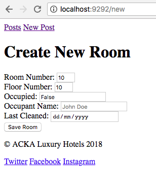

# 
 Sparta Sinatra Models Homework 

#### Task:

To ues what I was taught in the Sinatra Models Intro to create a SQL database, populate the table and create a website that is able to make requests to and from the database using the 7 RESTful routes. Similar to [Sinatra Models Intro](https://github.com/ACKAdeyemi/sparta-sinatra-models-intro) however this task includes the use of a database where as intro lesson made use data inside variable embedded into the resource controller.

This task makes use of:

* Sinatra DSL (a Domain Specific Language that allows us to setup RESTful routes)
* ERB (Embedded Ruby to combine HTML and Ruby)
* SQL (Structured Query Language for database interaction)
* Postgres (an ORDBMS to create the database)
* Mockaroo (to quickly create data to send into database)

**How to Download** - click 'clone or download' button, download a zip of our project, unzip, open the index.html and enjoy.

#### Challenges:
I found it quite difficult to choose input types on my form as I was thinking about the real implications it could have to, for instance, have a number type that is unlimited for a field that would send data to the database that could cause issues due to human error/malicious behaviour. One thing I'd like to explore in the future is extra funtionality/cleaner UX such as adding conditional statements to particular sections of my code, for example:

Below you will see a screenshot of a formula that I applied on Mockaroo to create my mock data however I didn't apply this logic to my HMTL form.erb code:

### 
 Mockaroo Mock Data Setup: 

The formula above adds 'Not Currently Occupied' to the occupant_name column if the occupied column is false meaning there isn't a guest in that room. However in the form below, the user would have to write 'Not Currently Occupied' manually (in order for it to be stored into the database) when the Occupied field is false.

### 
 Form fields to create 'New Room' info: 

I plan to come back to this project in the future to apply the above logic in my form.erb code; so that a user of the form can leave the Occupant Name field blank, set the occupied field to false and on submit, the program will check the contents the Occupied field (for false) and insert 'Not Currently Occupied' into the occupant_name column in the database and send that information to the views to render the data on the site via the model, directed by the controller.

#### Summary:
I really enjoyed this homework as it allowed me gain a strong understand into how people and businesses make use of APIs, MVC, RESTful routes and templates to perform CRUD. 
